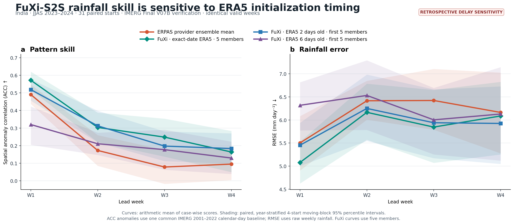
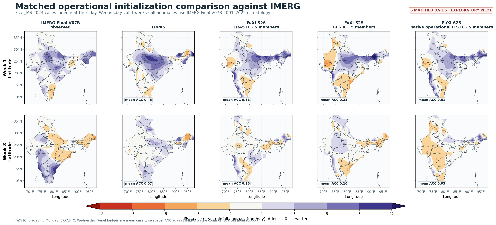

# IMERG meeting plots — 2026-08-18

This bundle contains two audited rainfall-verification figures over India.

## 31-case ERA5 initialization-delay sensitivity

- JJAS 2023–2024, 31 paired initializations, identical valid weeks.
- IMERG Final V07B is the verification reference.
- Every FuXi curve uses five members.
- The strongest supported result is at Week 1: exact-date ERA5 improves ACC
  over six-day-old ERA5 by 0.252 and reduces RMSE by 1.239 mm/day; both paired
  moving-block 95% intervals exclude zero.
- Later-week timing differences are less certain and should not be presented
  as a monotonic delay penalty.

## Five-case operational initialization pilot

- Five matched JJAS 2024 dates with identical Thursday–Wednesday valid weeks.
- FuXi ERA5, GFS, and native operational IFS initializations use five members.
- All anomalies use the fixed IMERG Final V07B 2001–2022 climatology, excluding
  the 2023–2024 verification years.
- Week-1 mean ACC is 0.45 for ERPAS, 0.51 for ERA5, 0.38 for GFS, and 0.51 for
  native operational IFS.
- This is an exploratory five-case pilot, not an established ranking of
  initialization sources.

Each output directory includes CSV data and a validation manifest with source
hashes, alignment checks, sample counts, and uncertainty metadata. The scripts
under `scripts/` reproduce the figures in the S2S analysis environment.
